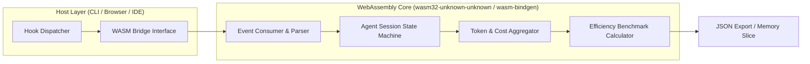

# Architecture: WASM Agent Manager & Analytics Engine

- **Date**: 2026-08-15
- **Author**: `architect`
- **Sources**: `docs/brief.md`, `docs/architecture-e7.md`, `plugins/agent-team/tui/rust/src/analytics/`
- Every claim below is labelled `[observed]`, `[inferred]` or `[assumed]`.

---

## 1. Overview & System Boundary

The **WASM Agent Manager & Analytics Engine** exposes a deterministic, high-throughput WebAssembly module compiled from the existing core Rust telemetry structures. It enables any host runtime (Gemini CLI, Browser, Node.js, Claude Code Hooks) to ingest lifecycle events, compute real-time agent token burn rates, and score agent efficiency with **zero LLM inference overhead**.



---

## 2. Component Responsibility

| Component | Responsibility | Forbidden Actions |
| :--- | :--- | :--- |
| `rust/src/wasm/mod.rs` | WASM entrypoints, `wasm-bindgen` FFI bindings, JSON ingestion and export | File I/O, network calls, rendering |
| `rust/src/wasm/state.rs` | Session lifecycle state machine (`running`, `handoff`, `failed`, `completed`) | Allocating unmanaged heap, touching host memory directly |
| `rust/src/wasm/metrics.rs` | Token burn calculations, model tier cost tracking (Flash vs Pro), cost rate estimation | Modifying global state |
| `rust/src/wasm/efficiency.rs` | First-pass success rate, token/code-unit ratio, tool error frequency | Non-deterministic clock access |

---

## 3. Dependency & Layering Rules

```
WASM FFI Boundary (`wasm/mod.rs`)
       │
       ▼
Session State (`wasm/state.rs`)
       │
       ▼
Metrics & Rates (`analytics/rates.rs` + `wasm/metrics.rs`)
       │
       ▼
Efficiency Scorer (`wasm/efficiency.rs`)
```

- **Strict Pure Function Contract**: The entire `wasm` module operates purely over in-memory buffers and strings.
- **Zero Syscalls**: No filesystem calls (`std::fs`), no subprocesses (`std::process`), no networking.

---

## 4. WASM API Seam & Interface Contract

```rust
#[wasm_bindgen]
pub struct WasmAgentManager {
    // Internal state store
}

#[wasm_bindgen]
impl WasmAgentManager {
    #[wasm_bindgen(constructor)]
    pub fn new() -> Self;

    /// Ingest a JSON event stream payload (e.g. from hooks)
    #[wasm_bindgen(js_name = ingestEvent)]
    pub fn ingest_event(&mut self, event_json: &str) -> Result<(), JsValue>;

    /// Generate aggregated session report in JSON format
    #[wasm_bindgen(js_name = getReportJson)]
    pub fn get_report_json(&self, session_id: &str) -> Result<String, JsValue>;

    /// Calculate efficiency score for a given session
    #[wasm_bindgen(js_name = getEfficiencyScore)]
    pub fn get_efficiency_score(&self, session_id: &str) -> Result<f64, JsValue>;
}
```

---

## 5. Verification & Quality Gates

1. **Unit Testing**: `cargo test` verifying state transitions and rate computations without WASM wrapper.
2. **WASM Build Target**: `cargo check --target wasm32-unknown-unknown` validating no OS-dependent syscalls leak into WASM.
3. **Parity Check**: Metrics produced by WASM must match `analytics/parse.rs` within `1e-9` tolerance.
