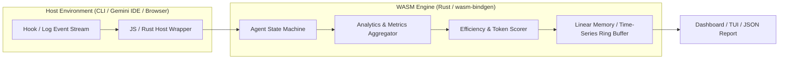

# Project Brief & PRD: WASM Agent Manager & Analytics Engine

## 1. Problem & Objectives
- **Problem**: Monitoring and measuring agent efficiency (token consumption, latency, retry counts, quality gate pass rates, cost) currently relies on manual log inspection or LLM subagent summaries, which wastes tokens and lacks real-time, deterministic telemetry.
- **Objective**: Build a lightweight, high-performance, and portable **WebAssembly (WASM) Engine Core** that can be embedded directly into the CLI/TUI or Web Browser to:
  1. **Manage Agent Lifecycle**: Track state transitions for each subagent (`running`, `handoff`, `failed`, `completed`).
  2. **Telemetry & Real-Time Analytics**: Calculate metrics deterministically (token burn rate, cost estimates, gate pass/fail ratio, latency per cognitive tier).
  3. **Zero Token Overhead for Analytics**: Process telemetry locally via compiled WebAssembly with zero LLM API calls.

---

## 2. Architecture Overview

---

## 3. Key Capabilities

### A. WASM Telemetry Processor
- Ingests event streams from lifecycle hooks (`TaskCompleted`, `PreToolCall`, `PostToolCall`, `SubagentSpawned`).
- Aggregates:
  - Total tokens spent (Input, Output, Cache read/write).
  - Task completion rates per model tier (`Flash` vs `Pro`).
  - Handoff efficiency (Boundary violations, compaction events, and retry counts).

### B. Efficiency Benchmark & Scoring Engine
- Computes efficiency metrics:
  - **First-Pass Gate Success Rate**: Percentage of tasks passing linters and tests on first attempt.
  - **Tokens per Code Unit**: Token consumption per accepted line of code or verified function.
  - **Tool Call Accuracy**: Count and ratio of failed/invalid tool invocations.

---

## 4. Implementation Phases

1. **Phase 1: Rust Core & WASM Bindings**:
   - Telemetry data structures, metrics aggregator, and WASM exports (`wasm-bindgen` / `wasm32-unknown-unknown`).
2. **Phase 2: Hook Event Emitters**:
   - Integrate event dispatchers in `plugins/agent-team/hooks/`.
3. **Phase 3: Interactive Visualizer & TUI Integration**:
   - Render the real-time efficiency dashboard inside the terminal / browser.
